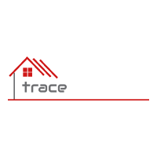

<h1 align="center">
  
   
A package tracking application
</h1>
<h4 align="center" style="margin-bottom:10px">Be sure to star our configuration repo so you can keep up to date on any daily progress!</h4>

  <h4>
    </a>
    
    
        
</h4>
 

This application is designed to track packages through user provided tracking number and carrier.  In return, the user will receive up to date information on their package. The layout and tracking capabilities should inspire you to streamline package tracking needs.  Feel free to use and contribute.

  <h4>
    <a href="https://github.com/adbergen/trace">
      GitHub Repository
    </a>
     | 
<a href="https://tracerx.herokuapp.com/">
      Heroku Deployment
    </a>
    
  </h4>

## Table of Contents

- [Installation](#installation)
- [Usage](#usage)
- [Technologies](#technologies)
- [Roadmap](#roadmap)
- [Contributing](#contributing)
- [License](#license)

## Installation

 
Using npm:

 
 

    npm install && npm start

## Usage

 This is a package tracking application that supports the following carriers' tracking information: 

<ul>
<li>UPS</li>
<li>DHL</li>
<li>Amazon</li>
<li>USPS</li>
<li>FedEx</li>
</ul>

## Technologies

<ul>
<li>HTML, CSS, Bootstrap, Bulma</li>
<li>Javascript, jQuery</li>
<li>node.js, Express, Seqeulize, MySQL, dotenv, Passport, Bcrypt</li>
<li>Heroku, GitHub</li>
<li>EasyPost API</li>
</ul>

## Roadmap

<ul>
<li>Automatically detect the shipping carrier</li>
<li>Email and user authentication</li>
<li>Implementing an Email and SMS notification</li>
<li>Adding a description to tracking number</li>
<li>Ability to print and create labels for postage</li>
<li>Implementing Google geolocation API</li>
<li>Monetization: Advertising, Link to paypal/ venmo, Selling data</li>
</ul>

## Contributing

- Pull requests are welcome. For major changes, please open an issue first to discuss what you would like to change.

- Contributors: Hojin, Lane, Anthony & Miguel

